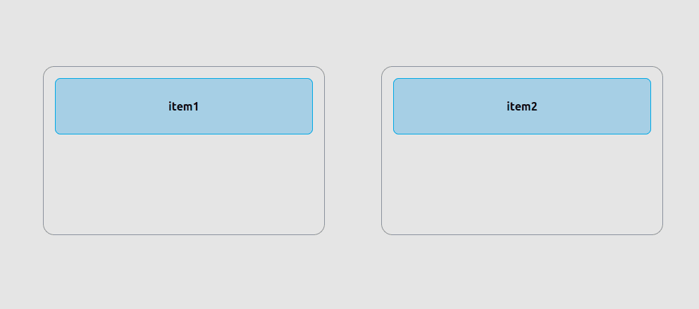

# Custom React Drag Image

This is a small project for customizing the React drag image (see it live [here](https://shojib116.github.io/react-drag-ghost/)).  
I also wrote about this on Medium — you can check it [here](https://medium.com/@shojib116/custom-drag-ghost-in-react-the-way-that-actually-works-c802e4ec7128).

The project focuses on basic DOM manipulation operations.  
If you can get a grip on this, you can use the same concept in any framework — including vanilla JS.

Happy coding! ✨
